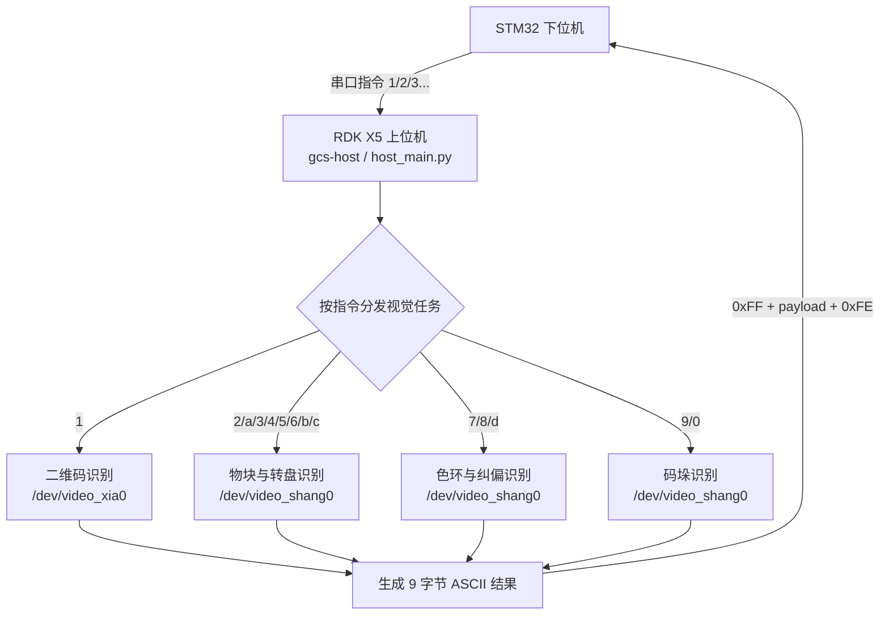

# gcs-host 上位机服务速查

当前约定：

- `/dev/ttyUSB0` 是上位机和 STM32 下位机之间的通信口。
- `gcs-host.service` 自启动后打开通信口，等待下位机指令并触发视觉任务。
- 上位机发送给下位机的数据帧格式为 `0xFF + 9字节ASCII负载 + 0xFE`。
- STM32 工程当前 `HOST_UART = USART1`，通信波特率为 `115200`。

## 上位机 / 下位机协作流程



## 本地文件

```text
/root/gcs-gold-medal-main/cv2_python/host_main.py
/etc/init.d/gcs-host
/var/log/gcs-host.log
```

## 常用命令

查看服务：

```bash
ssh rdk-x5-ts "ps -ef | grep host_main.py | grep -v grep"
```

查看日志：

```bash
ssh rdk-x5-ts "tail -80 /var/log/gcs-host.log"
```

重启服务：

```bash
ssh rdk-x5-ts "/etc/init.d/gcs-host stop || true; pkill -f host_main.py || true; /etc/init.d/gcs-host start"
```

本地自检：

```bash
python3 host_main.py --self-test
python3 host_main.py --camera-test
```

Windows 本机扫码预览首选批处理，避免 PowerShell profile 干扰：

```bat
run_qr_preview_windows.bat
```

Windows 本机圆环预览（一次只接一个 USB 摄像头）：

```bat
run_ring_preview_windows.bat
```

如果必须手动用 PowerShell，环境变量值要加引号：

```powershell
$env:GCS_QR_CAMERA = "1"
$env:GCS_CAMERA_BACKEND = "dshow"
py -3.10 .\host_main.py --qr-preview
```

当前 Windows 主机上已验证 `GCS_QR_CAMERA=1` 是可见摄像头；`2` 是 OBS Virtual Camera。

视觉调试：

```bash
python3 host_main.py --qr --dry-run-serial
python3 host_main.py --ring --dry-run-serial
python3 host_main.py --ring-centered --dry-run-serial
python3 host_main.py --maduo --dry-run-serial
python3 host_main.py --maduo-centered --dry-run-serial
```

远端自检：

```bash
ssh rdk-x5-ts "cd /root/gcs-gold-medal-main/cv2_python && python3 host_main.py --self-test"
ssh rdk-x5-ts "cd /root/gcs-gold-medal-main/cv2_python && python3 host_main.py --camera-test"
```

远端视觉调试：

```bash
ssh rdk-x5-ts "cd /root/gcs-gold-medal-main/cv2_python && python3 host_main.py --qr --dry-run-serial"
ssh rdk-x5-ts "cd /root/gcs-gold-medal-main/cv2_python && python3 host_main.py --ring --dry-run-serial"
ssh rdk-x5-ts "cd /root/gcs-gold-medal-main/cv2_python && python3 host_main.py --ring-centered --dry-run-serial"
ssh rdk-x5-ts "cd /root/gcs-gold-medal-main/cv2_python && python3 host_main.py --maduo --dry-run-serial"
ssh rdk-x5-ts "cd /root/gcs-gold-medal-main/cv2_python && python3 host_main.py --maduo-centered --dry-run-serial"
```

## 摄像头环境变量

默认：

```bash
GCS_QR_CAMERA=/dev/video_xia0
GCS_UPPER_CAMERA=/dev/video_shang0
GCS_CAMERA_BACKEND=v4l2
```

临时指定：

```bash
GCS_QR_CAMERA=/dev/video0 GCS_UPPER_CAMERA=/dev/video1 python3 host_main.py --camera-test
```

## 通信口环境变量

默认：

```bash
GCS_HOST_SERIAL=/dev/ttyUSB0
GCS_HOST_BAUD=115200
```

临时指定：

```bash
GCS_HOST_SERIAL=/dev/ttyUSB1 GCS_HOST_BAUD=115200 python3 host_main.py
```

只调视觉、不接下位机时：

```bash
GCS_DRY_RUN_SERIAL=1 python3 host_main.py --qr
```

## 预期启动日志

```text
gcs-host started: host-lower serial link ready.
上位机通信口: /dev/ttyUSB0 @ 115200
二维码摄像头: /dev/video_xia0
上方摄像头: /dev/video_shang0
```
